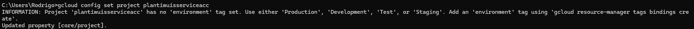

[# Clase 1: Introducción a la Nube y Ecosistema GCP](https://gamma.app/docs/Introduccion-a-la-Nube-y-Ecosistema-GCP-4zefezxfd19etz8?mode=doc)

## Resumen de la Clase

Esta primera clase de 4 horas se centra en el **Módulo 1**, sentando las bases de la computación en la nube y el ecosistema de Google Cloud Platform.

---

### **Módulo(s) Cubierto(s):**
*   **Módulo 1:** Introducción a la Nube y Ecosistema GCP (Completo)

### **Objetivos de Aprendizaje:**
*   Comprender los conceptos fundamentales de la computación en la nube (IaaS, PaaS, SaaS) y su ecosistema de servicios.
*   Entender el valor estratégico de la nube para proyectos de datos.
*   Familiarizarse con la estructura fundamental de GCP.

### **Contenidos a Cubrir:**
1.  **Introducción a la Computación en la Nube:**
    *   Modelos de servicio: IaaS, PaaS, SaaS.
    *   Modelos de implementación: Nube pública, privada, híbrida.
2.  **Fundamentos de Google Cloud Platform (GCP):**
    *   Jerarquía de recursos: Proyectos, carpetas, organización.
    *   Gestión de Identidad y Acceso (IAM): Roles y permisos.
    *   Facturación (Billing): Cuentas de facturación y presupuestos.

### **Actividades Prácticas:**
*   Exposición teórica interactiva sobre la arquitectura y servicios de GCP.
*   Demostración en vivo por parte del relator, navegando por la consola de GCP para ilustrar los conceptos de proyectos, IAM y facturación.

#### GCloud CLI
Luego de instalar el CLI de GCP podemos realizar las siguientes operaciones:


```bash
gcloud version
gcloud auth login
gcloud config list
gcloud config set project [PROJECT_ID]
```


```bash
# List compute instances (CLI)
gcloud compute instances list --filter="zone ~ ^us AND -machineType:f1-micro"
```


```bash
# Set Project (CLI)
```


```bash
# Services list (CLI)
```


```bash
# Components Alpha (CLI)
```


#### GCloud UI - Proyectos 

