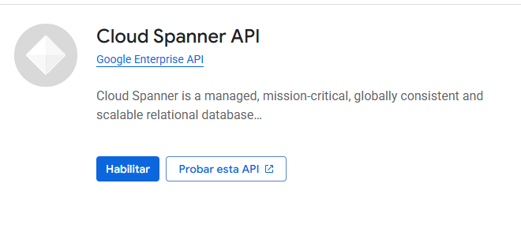
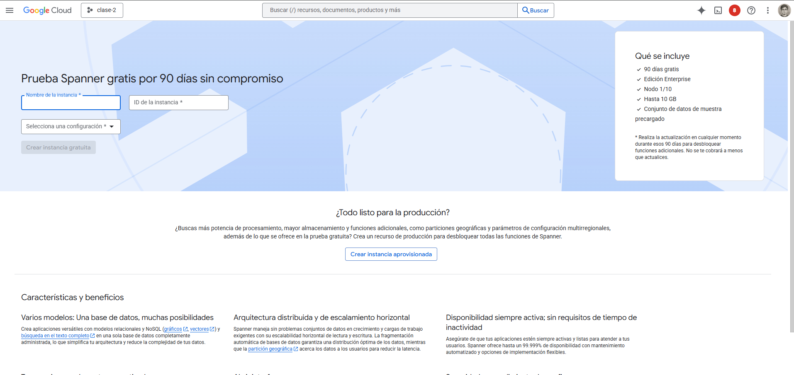
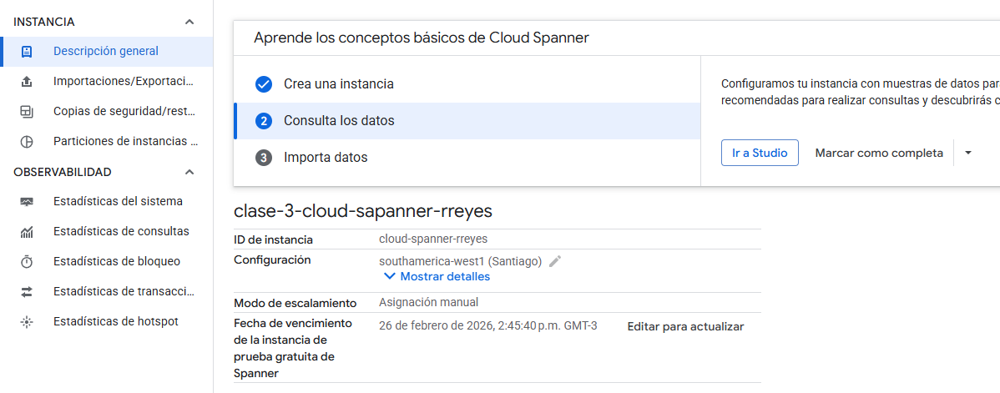
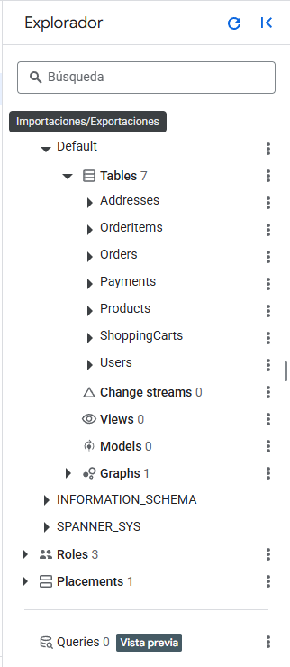
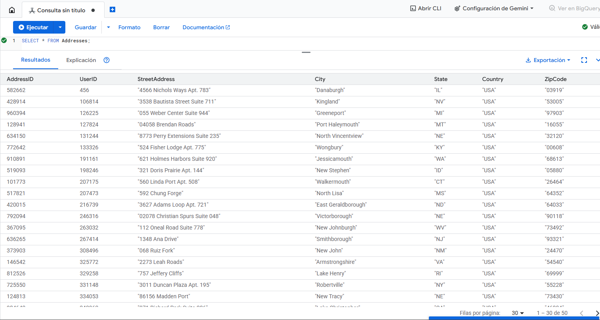
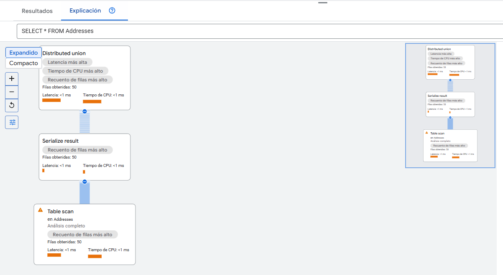

# Cloud Spanner – Explicación y Contexto (Continuación)
Cloud Spanner combina las capacidades de una base de datos relacional (SQL, transacciones ACID) con la escalabilidad horizontal típica de NoSQL, lo que lo convierte en un servicio ideal para cargas globales que requieren consistencia y alta disponibilidad.

Entre sus características principales encontramos:
- Escala horizontal ilimitada mediante "splits" automáticos de datos.
- Consistencia externa: todas las lecturas observan el último commit confirmado en el planeta.
- Alta disponibilidad global a través de réplicas distribuidas.
- SQL estándar, transacciones distribuidas.
- Administración completamente gestionada.
## Casos de uso: ¿Cuándo elegir Cloud Spanner vs Cloud SQL?
| Necesidad del proyecto                                | Cloud SQL | Cloud Spanner |
| ----------------------------------------------------- | --------- | ------------- |
| Alta consistencia                                     | ✔️        | ✔️            |
| Auditoría, ERP, CRM tradicionales                     | ✔️        | —             |
| Escalabilidad horizontal masiva                       | —         | ✔️            |
| Disponibilidad global (>99.999%)                      | —         | ✔️            |
| Migraciones simples desde MySQL/PostgreSQL/SQL Server | ✔️        | —             |
| Operación planetaria multiregión                      | —         | ✔️            |
| Millones de transacciones por segundo                 | —         | ✔️            |

Regla general:
➡️ Si tu aplicación no requiere escala global ni millones de TPS, Cloud SQL basta.
➡️ Si tu aplicación crece a nivel planetario o maneja operaciones bancarias, retail global o IoT masivo, usa Spanner.

## Arquitectura de Cloud Spanner
- Nodo Spanner: unidad de rendimiento (≈10,000 QPS aprox).

- Instancia Spanner: conjunto de nodos distribuidos.

- Splits: particiones automáticas basadas en rangos de clave primaria.

- TrueTime API: reloj global con sincronización por GPS y relojes atómicos (clave de la consistencia externa).

- Réplicas (3 o más):
    - Write replica
    - Read replica
    - Witness replica

# Inicio del Módulo 3: Migración de Datos a Google Cloud
## Introducción a la Migración de Datos
Google Cloud ofrece múltiples servicios para migrar datos desde ambientes on-premise, bases de datos locales, máquinas virtuales o sistemas heredados.

En esta clase se revisan:

- Migraciones online vs offline.

- Migraciones homogéneas vs heterogéneas.

- Servicios para mover datos desde archivos, BDDs relacionales o grandes volúmenes de datos.

### Estrategias de Migración
Migración Online

- La base de datos original sigue funcionando mientras se replica a Cloud SQL.

- Ideal para sistemas en producción.

- Usa Database Migration Service (DMS).

Migración Offline

- Se detiene la base de datos origen.

- Se exportan datos y luego se importan a Cloud SQL o BigQuery.

- Útil para sistemas pequeños o mantenimiento programado.

### Migraciones Homogéneas vs Heterogéneas.
| Tipo            | Descripción                            | Ejemplos                          |
| --------------- | -------------------------------------- | --------------------------------- |
| **Homogénea**   | Origen y destino usan el mismo motor   | MySQL → Cloud SQL MySQL           |
| **Heterogénea** | Motores distintos; requiere conversión | SQL Server → Cloud SQL PostgreSQL |

## Database Migration Service (DMS)
DMS es el servicio nativo de GCP para migrar bases de datos hacia Cloud SQL.

Características
- Sin costo adicional (solo pagas Cloud SQL).
- Migración online en tiempo real.
- Replicación continua.
- Verificación de compatibilidad previa.
- Soporta:
    - MySQL
    - PostgreSQL
    - SQL Server (preview en algunos países)

### Creación de un trabajo de migración (demostración)
- Ir a Database Migration desde el menú.

- Elegir Create Migration Job.

- Seleccionar el motor origen (MySQL, PostgreSQL, SQL Server).

- Conectar a la base de datos local o remota.

- Validar conectividad (firewall, credenciales).

- Elegir la instancia destino en Cloud SQL.

- Configurar migración online/offline.

- Iniciar el proceso y revisar logs.

## Transfer Appliance / Storage Transfer Service
Transfer Appliance

Dispositivo físico enviado por Google para mover grandes cantidades de datos cuando:

Existen decenas de terabytes (TB) o petabytes (PB).

El ancho de banda no permite subir todo por internet.

Los datos deben moverse de forma segura.

Storage Transfer Service

Servicio online ideal para:

Migrar datos desde buckets S3, Azure, GCP u otros.

Programar sincronizaciones automáticas.

Copiar o mover datos entre buckets y regiones.

## Ingresar a Cloud Spanner


El servicio Cloud Spanner necesita acceso adicional, si ingresamos encontraremos el siguiente mensaje:

Permisos faltantes o bloqueados:

```bash
spanner.instanceConfigs.list
spanner.instances.list
```

Podemos solicitar los permisos necesarios al Propietario del proyecto o en su defecto, nos pueden otorgar los permisos previamente al uso del servicio según la buena práctica de Computación en la nube para otorgar los mínimos privilegios a cada usuario.

## Cloud Spanner API


Cloud Spanner is a managed, mission-critical, globally consistent and scalable relational database.

## Roles


En cuanto a lo que refiere a Roles, asignaremos desde la cuenta de Propietario el rol de Administrador de Cloud Spanner a los participantes de este curso.



## Crear instancia
Una vez asignados el rol y los permisos correspondientes, nos encontraremos  con esta vista donde nos informan que tenemos un periodo de prueba gratuito de 90 días.


La configuración que asigné inicialmente es la siguiente:
- Nombre de la instancia: clase-3-cloud-sapanner-rreyes
- ID de la instancia: cloud-spanner-rreyes
- Configuración: southamerica-west1 (Santiago)



## Studio
Una vez creada la instancia, veremos un menú como el de la imagen anterior, donde presionamos el botón "Ir a Studio".



Al igual que Cloud SQL, podramos encontrar un menú en la parte izquierda de la pantalla. Observamos que esta instancia está conectada a una BDD por defecto con las siguientes características:

- Schemas: 3
    - Default Schema:
        - Tablas: 7
        - Change streams: 0
        - Views:
        - Models:
        - Graphs:
- Roles: 3
- Placements: 1
- Querys: 0

### Editor SQL


En el editos de SQL ejecutamos una instrucción de prueba sobre la primera de las tablas disponibles, usted puede probar las consultas que le parezcan pertinentes.

## Explicación


