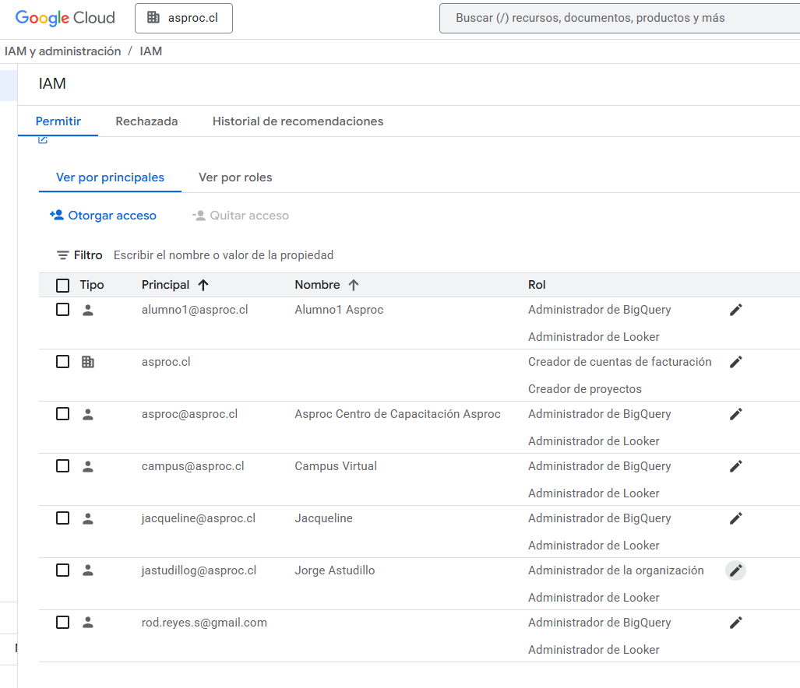

Administrador de looker
looker.instances.list

Para crear una instancia, debes tener los permisos necesarios.
Permisos necesarios: 
Todos los siguientes: 

looker.instances.create
monitoring.timeSeries.list
serviceusage.quotas.get